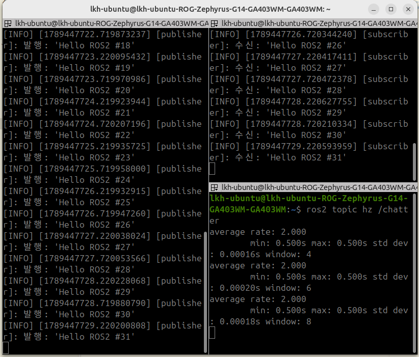
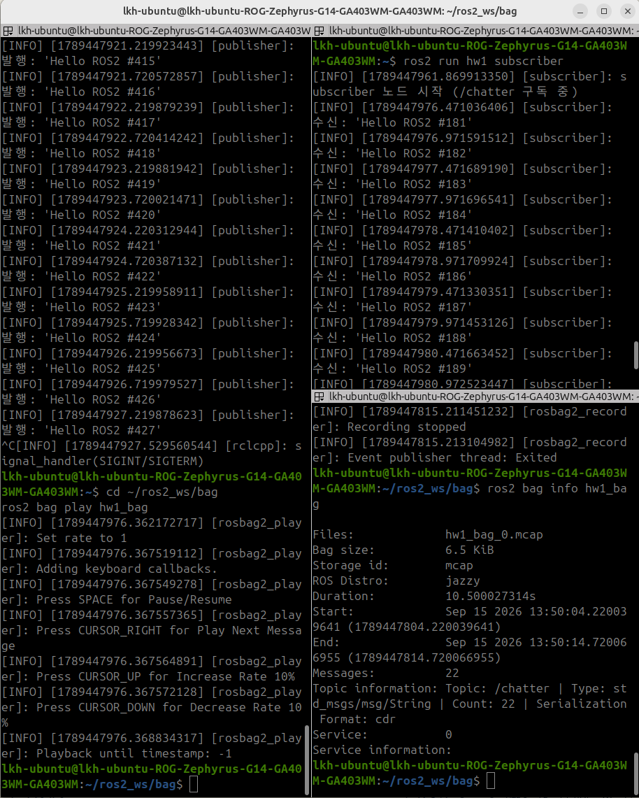

# HW_1

1. Publisher / Subscriber 노드 한 쌍 작성 (C++)
2. ros2 bag으로 검증 파이프라인 구성

## 실행 결과

### 1. Publisher / Subscriber

- publisher가 0.5초마다 `Hello ROS2 #n`을 발행하고, subscriber가 같은 번호로 수신한다.
- `ros2 topic hz /chatter` 결과 `average rate: 2.000`으로 0.5초 주기를 확인했다.

### 2. ros2 bag 기록 → 재생

- `ros2 bag record -o hw1_bag /chatter`로 약 10초간 기록했다. `bag info` 결과 메시지 22개가 저장됐다.
- publisher를 끄고 `ros2 bag play hw1_bag`을 실행하자, subscriber가 기록된 메시지(`#181`~)를 다시 수신했다.

## 간단히 ROS2에 대해 공부한 것

1. 노드는 `rclcpp::Node`를 상속한 클래스로 만들고, `main`에서 `init → spin → shutdown` 순서로 실행한다.
2. publisher는 타이머로 주기적으로 `publish()`를 호출하고, subscriber는 메시지가 올 때만 콜백이 호출된다. 토픽 이름만 같으면 연결된다.
3. `CMakeLists.txt`에 `add_executable`, `ament_target_dependencies`, `install`을 적고, `colcon build` → `source install/setup.bash` → `ros2 run` 순서로 실행한다.
4. ros2 bag은 토픽을 녹화했다가 재생하는 도구라서, 실제 노드 없이도 같은 데이터로 테스트할 수 있다.
