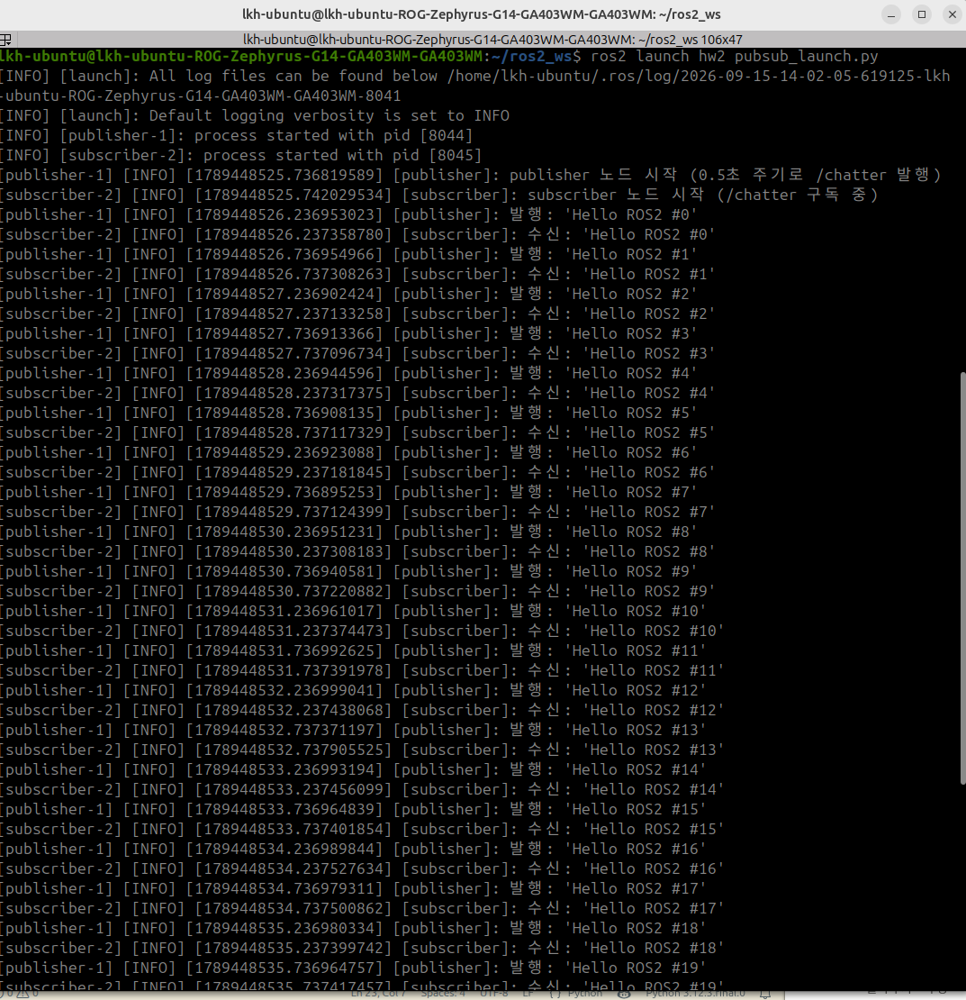
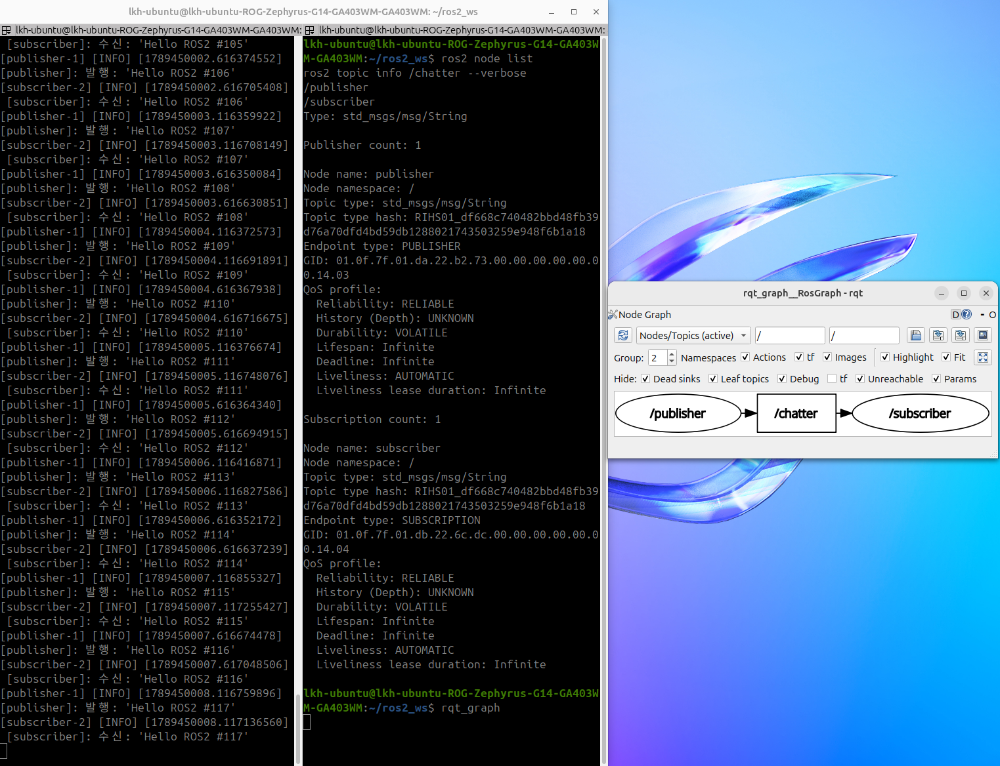

# HW_2

1. launch 파일로 두 노드 동시 실행
2. rqt_graph로 시스템 구조 문서화

## 실행 결과

### 1. launch로 동시 실행

- `ros2 launch hw2 pubsub_launch.py` 한 번으로 `[publisher-1]`, `[subscriber-2]` 두 노드가 같이 실행된다.
- `Ctrl+C` 한 번에 두 노드가 같이 종료된다.

### 2. 노드 / 토픽 구조 + rqt_graph

- `ros2 node list`: `/publisher`, `/subscriber`
- `ros2 topic info /chatter --verbose`: Publisher 1개, Subscription 1개, QoS는 양쪽 모두 `RELIABLE`
- rqt_graph: `/publisher` → `/chatter` → `/subscriber` (타원은 노드, 네모는 토픽)

## 간단히 ROS2에 대해 공부한 것

1. launch 파일은 `generate_launch_description()`에서 `Node(package, executable)`를 실행할 노드 수만큼 등록한다.
2. C++ 패키지에서 launch를 쓰려면 `CMakeLists.txt`에 `install(DIRECTORY launch ...)`가 필요하다.
3. `colcon build --symlink-install`을 쓰면 launch.py 같은 파일은 수정 후 다시 빌드하지 않아도 반영된다.
4. rqt_graph는 토픽 연결만 보여 주고 서비스는 표시하지 않는다.
