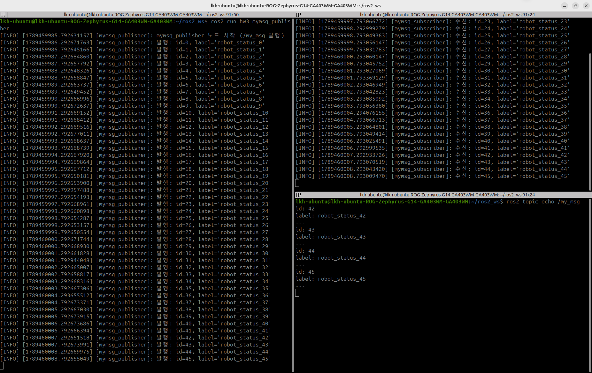
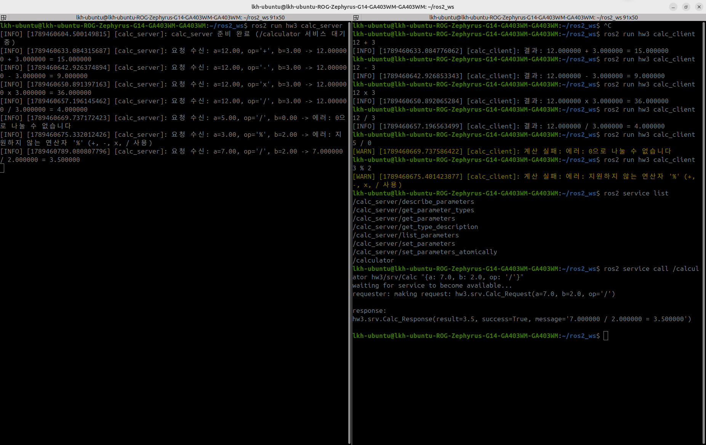

# HW_3

1. 커스텀 msg(`MyMsg`: `int32 id`, `string label`) 정의 후 퍼블리시
2. 사칙연산 계산기 서비스 서버 / 클라이언트

## 실행 결과

### 1. MyMsg 발행 / 구독

- `mymsg_publisher`가 `id`, `label`을 채워 0.5초마다 발행하고, `mymsg_subscriber`가 같은 값을 수신한다.
- `ros2 topic echo /my_msg`에서 `id`와 `label`이 필드별로 출력된다.

### 2. 계산기 서비스

| 입력 | 결과 |
|---|---|
| `12 + 3` / `12 - 3` / `12 x 3` / `12 / 3` | `15` / `9` / `36` / `4` |
| `5 / 0` | 에러: 0으로 나눌 수 없습니다 |
| `3 % 2` | 에러: 지원하지 않는 연산자 |
| `ros2 service call` (7 / 2) | `result=3.5, success=True` |

- 잘못된 입력에도 서버가 종료되지 않고 에러 메시지로 응답한다.

## 간단히 ROS2에 대해 공부한 것

1. `.msg`, `.srv` 파일을 만들고 빌드하면 C++ 헤더가 자동 생성된다. (`MyMsg` → `hw3/msg/my_msg.hpp`)
2. `.srv`는 `---`를 기준으로 위가 요청, 아래가 응답이다.
3. 토픽은 응답 없이 계속 보내는 방식이고, 서비스는 요청을 보내면 응답이 돌아오는 1:1 방식이다.
4. 클라이언트는 `wait_for_service` → `async_send_request` → 응답 대기 순서로 동작한다.
