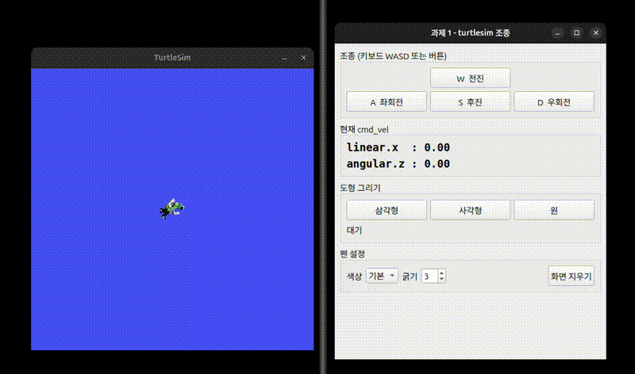

# HW_1

Qt GUI로 turtlesim 조종

### 실행 결과

실행 영상은 같은 폴더에 `hw1.webm`으로 첨부했다.

### 추가적인 코드 설명

퍼블리셔를 이용하여 거북이의 전진/후진 속도와 회전 속도(cmd_vel)를 전송하고, 같은 토픽을 구독해서 현재 cmd_vel 값을 GUI에 실시간으로 출력한다. 키보드 WASD 입력과 버튼 입력을 모두 구현하였다.

도형 그리기는 타이머와 각속도로 회전 각도를 계산해서 구현했다. 거북이는 1초 이상 속도 데이터가 들어오지 않으면 멈추기 때문에 100ms마다 속도를 계속 보내고, 1초씩 전진과 회전을 번갈아 시켰다. 삼각형은 1초에 2π/3, 사각형은 π/2만큼 회전하고, 원은 전진 속도와 각속도를 동시에 주어 한 바퀴를 돈다.

굵기(1~10)와 색상(6가지)은 set_pen 서비스 클라이언트로 전송한다. 추가로 화면 지우기 버튼(/clear 서비스)과 도형 진행 상태(그리는 중, 완료) 표시를 넣었다.
