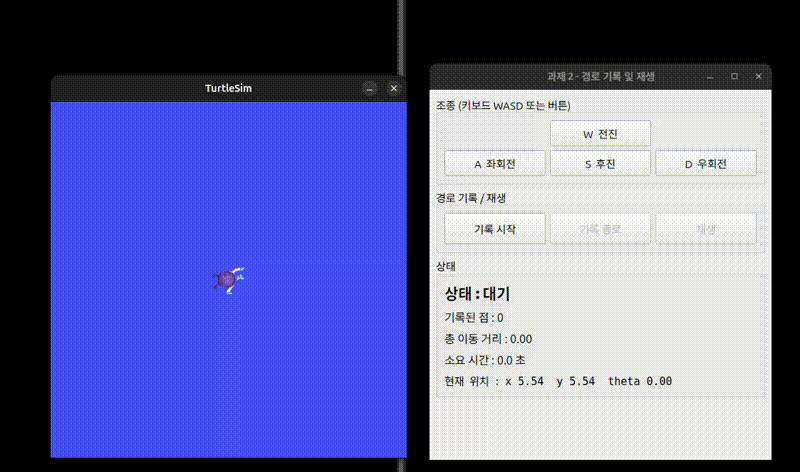

# HW_2

turtlesim 경로 기록 및 재생

### 실행 결과

실행 영상은 같은 폴더에 `hw2.webm`으로 첨부했다.

### 추가적인 코드 설명

`/turtle1/pose`를 구독해서 최신 위치를 저장하고, 기록 중일 때 100ms 타이머마다 위치를 배열에 추가한다. 이전 점과의 거리를 더해서 총 이동 거리를 구하고, QElapsedTimer로 소요 시간을 잰다.

재생 버튼을 누르면 저장된 위치를 같은 주기로 teleport_absolute 서비스에 순서대로 보내서 같은 경로를 재현한다. 실행 결과에서 기록과 재생 모두 점 430개, 총 이동 거리 40.48로 같게 나왔다.

상태는 대기, 기록 중, 재생 중 세 가지로 나누고 상태에 따라 버튼을 켜고 끈다. 추가로 재생 경로를 빨간 펜으로 그려서 원래 경로와 비교할 수 있게 했고, 시작점으로 이동할 때는 펜을 꺼서 선이 그어지지 않게 했다.
