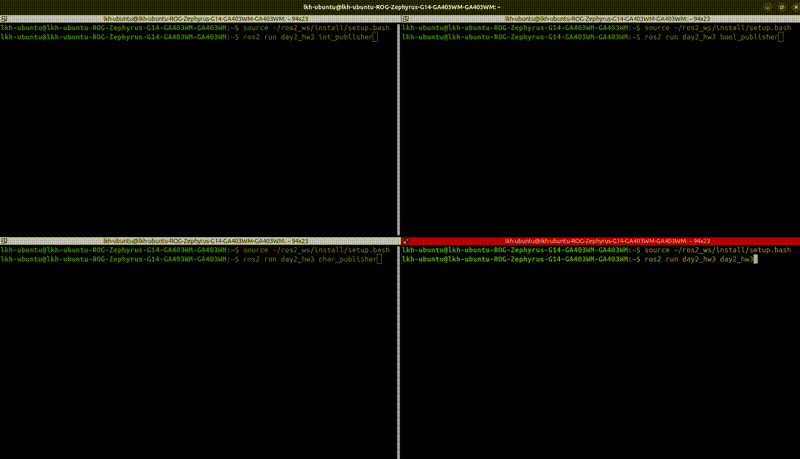

# HW_3

QThread 기반 다중 토픽 모니터링 대시보드

### 실행 결과

실행 영상은 같은 폴더에 `hw3.webm`으로 첨부했다.

### 추가적인 코드 설명

랜덤 정수, 랜덤 bool, 랜덤 문자를 0.5초마다 발행하는 퍼블리셔 노드 3개를 만들고, GUI의 QThread(QNode)에서 세 토픽을 동시에 구독한다. 받은 값은 시그널로 GUI에 전달해서 최신 값과 수신 횟수를 실시간으로 출력한다.

토픽마다 마지막으로 받은 시각을 저장하고, 타이머로 2초 이상 메시지가 없으면 "응답 없음"으로 표시한다. 퍼블리셔 노드를 Ctrl+C로 끄면 해당 토픽만 응답 없음으로 바뀌고, 다시 실행하면 연결됨으로 돌아온다.

재시작 요청 버튼은 Trigger 서비스 클라이언트로 각 퍼블리셔 노드에 요청을 보낸다. 서버는 발행 타이머와 발행 횟수를 초기화하고 결과 메시지를 돌려준다. 노드가 꺼져 있으면 서비스 서버도 없기 때문에 "서비스 서버가 없음"을 표시한다.
