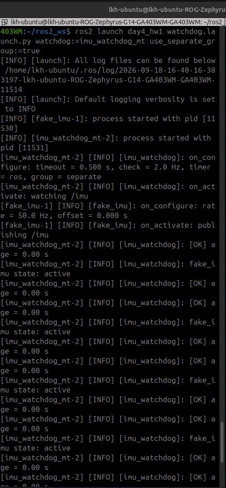
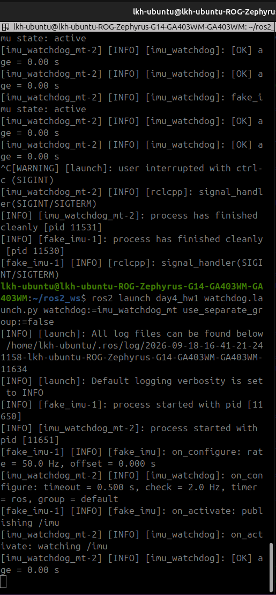

# Day4_hw1

이규환 2026406017

---

## 1. 개요 (Overview)

심화 1일차 `imu_watchdog` 에 "1초마다 `/fake_imu/get_state` 로 센서 노드 상태를 물어 로그로 출력하는" 기능을 추가한 프로그램이다. `fake_imu` 는 1일차 코드를 그대로 두고 `imu_watchdog` 만 고쳤다.

단계별 코드를 지우지 않고 실행파일 3개로 나눠 두어 채점자가 데드락과 해결을 각각 재현할 수 있게 하였다.

| 실행파일 | 역할 |
| --- | --- |
| `fake_imu` | 1일차와 동일 (수정 없음) |
| `imu_watchdog` | 2.2 정답. 비동기 호출 + 응답 콜백 |
| `imu_watchdog_sync` | 2.1 일부러 틀리기. 타이머 콜백 안에서 `future.wait()` |
| `imu_watchdog_mt` | 2.4 선택. 2.1 코드 유지 + callback group + MultiThreadedExecutor |

세 watchdog 모두 노드 이름은 `imu_watchdog` 이라서 CLI 명령은 동일하게 쓸 수 있다.

## 2. 체크포인트 (checkpoint)

모든 영상은 `./etc` 폴더 안에 저장되어 있음.

### 2.1 일부러 틀리기

```cpp
auto request = std::make_shared<GetState::Request>();
auto future = state_client_->async_send_request(request); //요청 보내기
future.wait(); //콜백 안에서 응답 완료를 기다림
RCLCPP_INFO(
  get_logger(), "fake_imu state: %s",
  future.get()->current_state.label.c_str()); //이 줄은 출력되지 않음
```

<video src="./etc/hw1_Ch1.webm" controls width="600" autoplay loop muted></video>

타이머 콜백 안에서 응답 완료를 기다리도록 구현하였다. `imu_watchdog` 이 active 로 올라가고 1초 뒤 상태 타이머가 처음 돌면서 노드 전체가 멈춘다. `waiting for fake_imu get_state response` 까지만 찍히고 `fake_imu state:` 는 나오지 않으며, age 검사 로그(`[STALE]`, `[RECOVERED]`)도 같이 멈춘다.

`ros2 lifecycle get /imu_watchdog` 은 응답이 없어 timeout 으로 끝나지만, 같은 시점에 `ros2 service call /fake_imu/get_state` 는 `active` 를 정상 반환한다. 상대 노드는 멀쩡하고 내 노드의 executor 만 막힌 것이다.

### 2.2 해결

```cpp
auto request = std::make_shared<GetState::Request>();
state_client_->async_send_request(
  request,
  [this](rclcpp::Client<GetState>::SharedFuture future) {on_sensor_state(future);}); //요청만 보내고 바로 반환
```

<video src="./etc/hw1_Ch2.webm" controls width="600" autoplay loop muted></video>

요청과 응답 처리를 나누어 타이머 콜백이 실행 흐름을 붙잡지 않게 하였다. `fake_imu state: active` 가 1초마다 출력되고 age 검사도 정상으로 돈다. `ros2 lifecycle get /imu_watchdog` 도 즉시 응답한다.

`state_request_pending_` 플래그로 이전 응답을 받기 전에는 새 요구를 보내지 않게 막았다. 상대가 느리게 응답할 때 요청이 쌓이는 것을 방지하기 위한 것이다.

### 2.3 상태 따라가기

<video src="./etc/hw1_Ch3.webm" controls width="600" autoplay loop muted></video>

`fake_imu` 를 deactivate → cleanup → configure → activate → shutdown 순으로 전이시키니 `fake_imu state:` 로그가 `inactive` → `unconfigured` → `inactive` → `active` → `finalized` 를 따라갔다. deactivate 구간에서는 `/imu` 가 끊겨 `[STALE]` 이 찍히고, activate 하면 `[RECOVERED]` 로 돌아온다.

`fake_imu` 프로세스를 종료하면 서비스가 사라져 `fake_imu get_state not available` 경고로 바뀌고, 호출은 시도하지 않는다.

### 2.4 callback group + MultiThreadedExecutor 로 해결하기

2.1 의 동기 대기 코드를 그대로 두고 `use_separate_group` 파라미터로 그룹만 바꿀 수 있게 하였다.

```cpp
if (use_separate_group_) {
  client_group_ = create_callback_group(rclcpp::CallbackGroupType::MutuallyExclusive); //타이머와 다른 그룹
  state_client_ = create_client<GetState>(
    "/fake_imu/get_state", rclcpp::ServicesQoS(), client_group_);
} else {
  state_client_ = create_client<GetState>("/fake_imu/get_state"); //노드 기본 그룹
}
```



그룹을 따로 만들어 클라이언트를 넣은 경우다. 응답 처리가 다른 그룹에서 다른 스레드로 실행되므로 동기 대기 코드 그대로도 `fake_imu state:` 가 정상 출력된다.



그룹을 나누지 않고 MultiThreadedExecutor 만 쓴 경우다. 타이머와 클라이언트가 같은 MutuallyExclusive 그룹이라 응답 처리가 타이머 콜백이 끝나기 전에는 실행될 수 없어 2.1 과 똑같이 멈춘다. 스레드 수보다 그룹 설계가 먼저라는 것을 확인하였다.

## 3. 간단한 설명

클라이언트는 `on_configure` 에서 만들고 `on_cleanup`·`on_shutdown`·`on_error` 에서 해제하며, 상태 타이머는 `on_activate` 에서 만들고 `on_deactivate` 에서 정지한다. 서비스가 없으면 호출하지 않고 경고만 남긴다. 기존 age 검사 기능은 그대로 유지하였다.

과제 명세 외 추가한 부분은 두 가지다. 상태 조회 주기를 `state_period_sec` 파라미터로 뺀 것과, 2.4 의 그룹 분리 여부를 `use_separate_group` 파라미터 하나로 전환할 수 있게 해 한 실행파일에서 두 경우를 모두 재현할 수 있게 한 것이다.

실행 영상 `hw1_Ch1.webm` ~ `hw1_Ch3.webm` 도 같은 폴더에 함께 넣어 두었다.
